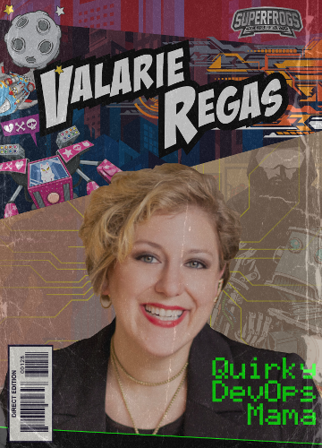

# [Valarie Regas](https://valarieregas.com)

The purpose of this project is to make easily available my personal promotional materials to conference organizers, and others at whose events I might be presenting.

### Social Media Links:

- [Personal Site](https://valarieregas.com)
- [Twitter](https://twitter.com/ValarieRegas)
- [LinkedIn](https://www.linkedin.com/in/valarieregas/)
- [Notist Speaker's Profile](https://noti.st/valarieregas)
- [Slides.com](slides.com/valarieregas)
- [The CodePrep Podcast](https://www.codeprep.io/podcast/)
  - Co-host/creator - archived 2020
- [jFrog's SuperFrogs Program](https://jfrog.com/superfrogs/)
- [YouTube Speaking Playlist](https://www.youtube.com/playlist?list=PLRpeqT8aG8cRlnQZJT6KJkG9uBYaSB0bT)
  - A collection of videos of past speaking engagements, as well as interviews

### [Available Sessions on PaperCall](https://www.papercall.io/speakers/valarieregas)

### [Past Speaking Engagements](https://github.com/ValarieR/Speakers-Bio/blob/master/PastSpeakingEngagements.md)

### [Current Resume](https://github.com/ValarieR/Speakers-Bio/blob/master/VRegasResumeCommunity.jpg)

### Preferred Bios:

- Valarie Regas is a DevOps fanatic, accomplished speaker, a Georgia Tech coding boot camp graduate, and a veteran mommy. She holds a BA in Psychology and currently works in Developer Relations. After years being a stay-at-home mom, she decided to change her life by entering tech, and has learned a lot along the way. In addition to DevOps, she enjoys mixed martial arts fighting, table-top role playing games, public speaking, creating tiny humans, and activism of all sorts.

---

- I am a DevOps fanatic, accomplished speaker, a Georgia Tech coding boot camp graduate, and a veteran mommy. I hold a BA in Psychology and currently work in Developer Relations. After years being a stay-at-home mom, I decided to change my life by entering tech, and have learned a lot along the way. In addition to DevOps, I enjoy mixed martial arts fighting, table-top role playing games, public speaking, creating tiny humans, and activism of all sorts.